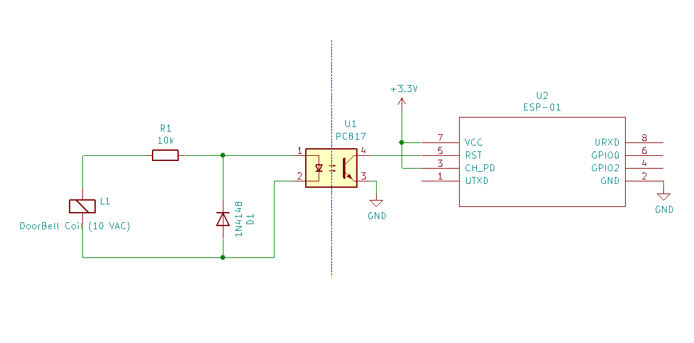

# Doorbell IoT

This script triggers an IFTTT webhook on start and then go to deep sleep until a reset fires it again (by pulling RST pin to GND)

- Set up `config.example` into `config.h` with your settings.
- Upload the code into an ESP-01

1. When get power
2. LED_BUILTIN will blink while connecting to wifi
3. Wifi connected > blinks 3 times
4. Flash and stay (sending POST to IFTTT)
5. POST OK > blink 3 times
6. Go to deep sleep mode (~3 uA)

[reset ESP to repeat]

If wifi coulnd't connect it will reset itself and try again but if POST response with an error will go into an infinite loop flashing per 1 second (on debug mode, otherwhise it will just go to sleep again)

When you are ready debugging comment `#define` line for `LED_BUILTIN` at `config.h` and re-upload.

---

## Power source

My plan is to use an 18650 with a 3v3 zener diode but I haven't any so I'll update it sooner, so far I pluged in the 18650 cell directly (4.2v) so fingercross to not get a burned ESP soon.

## How it works

Schema:

My building doorbell uses a system where the "bell" itself is an electromagnet which is activated from a 10VAC signal (from a source I don't have access to) and the sound is the vibration of that 60 hz ON/OFF signal which I cannot hear at least I'm next to it.

I have based this implementation on [this idea](https://github.com/tIsGoud/Doorbell-via-Wemos-and-optocoupler) thus Optocoupler will trigger an ESP-01 reset when someone rings the bell.
